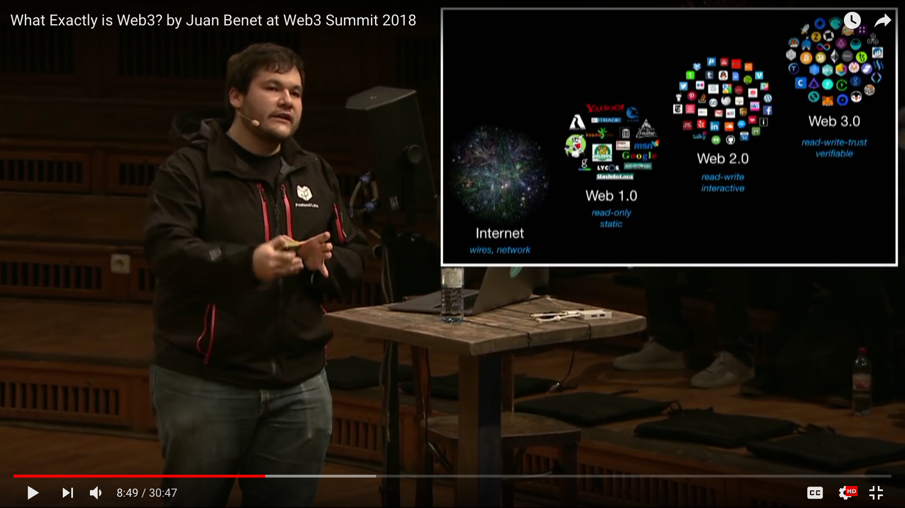
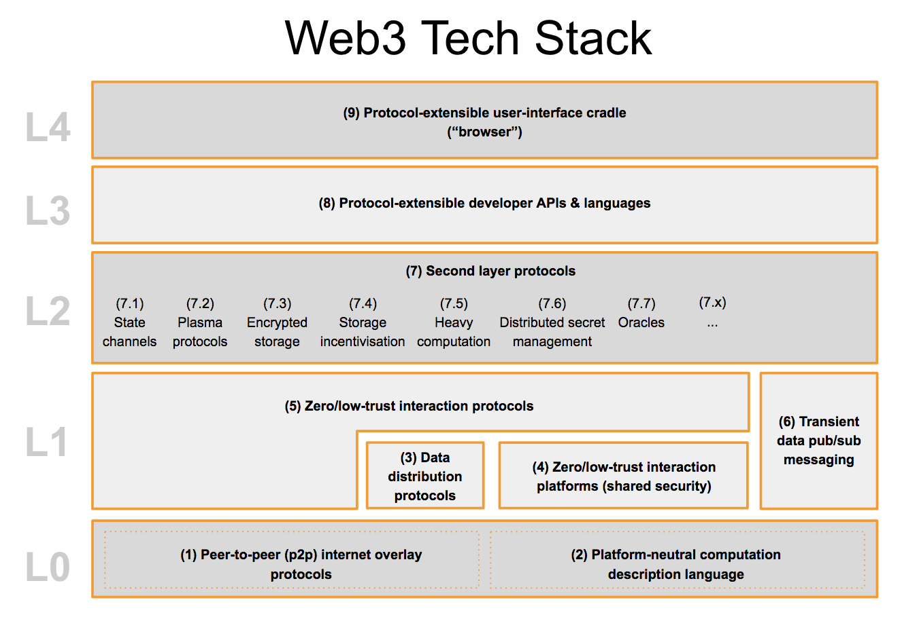

### Web3 Summit 2018
###### Berlin

https://gitpitch.com/rjchow/Web3Summit-2018/master
---

### Overview:
- Web3 Foundation / Web3
- Web3 Tech Stack
- Governance
- CTF

---

### What is Web 3.0 ?

---
### Webs 1 .. 2 .. 3?

- Web 1.0: Read-Only (Static)
- Web 2.0: Read-Write (Interactive)
- Web 3.0: Read-Write-Trust (Verifiable)

Note:

Examples

1.0: Geocities, Yahoo, Google

2.0: Twitter, Facebook, AirBnB

3.0: Buidling in progress! 

---

Web 3.0 is a broad movement and a group of associated technologies aiming to make the web and the internet more decentralised, verifiable, and secure.]

The goals of Web 3.0 include (a) trustless infrastructure; (b) removing intermediaries; and (c) giving users power and ownership over their data, identiy, security, and transactions.

https://medium.com/@gavofyork/why-we-need-web-3-0-5da4f2bf95ab

---

### Web3 Foundation
@quote[The Web3 Foundation nurtures and stewards technologies and applications in the fields of decentralized web software protocols, particularly those which utilize modern cryptographic methods to safeguard decentralization, to the benefit and for the stability of the Web3 ecosystem.]

https://web3.foundation

---

### Web3 Tech Stack

---

---

### Notable Projects

---

### Matrix

---

@quote[Matrix defines a set of open APIs for decentralised communication, suitable for securely publishing, persisting and subscribing to data over a global open federation of servers with no single point of control. Uses include Instant Messaging (IM), Voice over IP (VoIP) signalling, Internet of Things (IoT) communication, and bridging together existing communication silos - providing the basis of a new open real-time communication ecosystem.]

https://matrix.org/docs/spec/

---

---

### LibP2P

Enable the use of various:
transports: TCP, UDP, SCTP, UDT, uTP, QUIC, SSH, etc.
authenticated transports: TLS, DTLS, CurveCP, SSH
Make efficient use of sockets (connection reuse)
Enable communications between peers to be multiplexed over one socket (avoiding handshake overhead)
Enable multiprotocols and respective versions to be used between peers, using a negotiation process
Be backwards compatible
Work in current systems
Use the full capabilities of current network technologies
Have NAT traversal
Enable connections to be relayed
Enable encrypted channels
Make efficient use of underlying transports (e.g. native stream muxing, native auth, etc.)

---

### IPFS

---

### Aragon

---
### Polkadot

https://polkadot.network

---

### Starkware
https://www.starkware.co

---
### Governance

---

Talk about what Governance is and why it is necessary for Ethereum / Web 3
---
Declare your Governance rules such that it is fair regardless of which role you play, i.e you do not know which role you will play in advance

---

### Solidified CTF

http://s3.amazonaws.com/airdropchallenges/index.html
