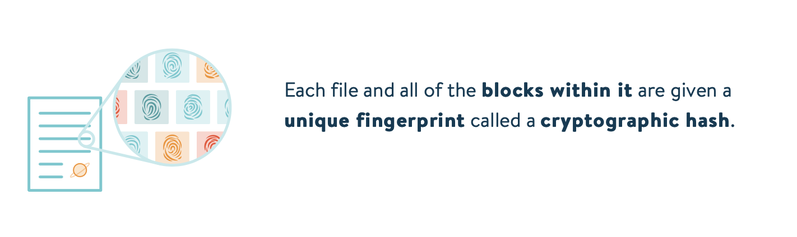
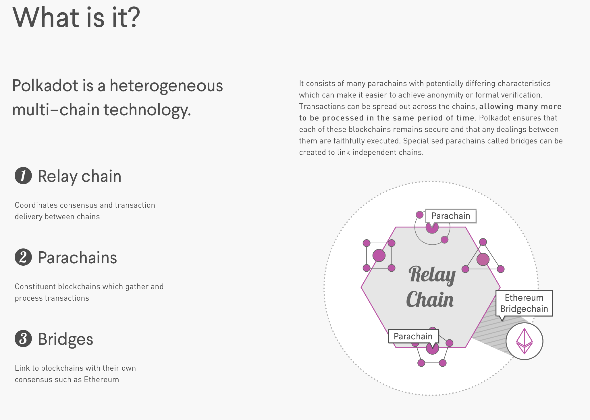

### Web3 Summit 2018
###### Berlin
+++

https://gitpitch.com/rjchow/Web3Summit-2018/master
---

### Overview:
- Web3 Foundation / Web3
- Web3 Tech Stack
- Governance
- CTF

---

### What is Web 3.0 ?

---
@snap[west]

Web 3.0 is a broad movement and a group of associated technologies aiming to make the web and the internet more decentralised, verifiable, and secure.
@snapend
---

@snap[west]
The goals of Web 3.0 include 
<ul>
<li>trustless infrastructure</li> 
<li>removing intermediaries</li> 
<li>giving users power and ownership over their data, identity, security, and transactions.</li>
</ul>
  
<a href="https://medium.com/@gavofyork/why-we-need-web-3-0-5da4f2bf95ab">Why we need Web 3.0 - Gavin Wood</a>
@snapend
---
### Webs 1 .. 2 .. 3?

- Web 1.0: Read-Only (Static)
- Web 2.0: Read-Write (Interactive)
- Web 3.0: Read-Write-Trust (Verifiable)

Note:

Examples

1.0: Geocities, Yahoo, Google

2.0: Twitter, Facebook, AirBnB

3.0: Buidling in progress! 
---

###### Web3 Foundation
@quote[The Web3 Foundation nurtures and stewards technologies and applications in the fields of decentralized web software protocols, particularly those which utilize modern cryptographic methods to safeguard decentralization, to the benefit and for the stability of the Web3 ecosystem.]

https://web3.foundation

---

### Web3 Tech Stack

+++
@title[Tech Stack Overview]

+++
@title[Tech Stack 2]

+++
@title[Tech Stack 3]

+++
@title[Tech Stack 4]

+++
@title[Tech Stack 5]

+++
@title[Tech Stack 6]

+++
@title[Tech Stack 7]

+++
@title[Tech Stack 8]

+++
@title[Tech Stack 9]

+++
@title[Tech Stack 10]

---

### Notable Projects

---

### Matrix

+++

@quote[Matrix defines a set of open APIs for decentralised communication, suitable for securely publishing, persisting and subscribing to data over a global open federation of servers with no single point of control. Uses include Instant Messaging, Voice over IP signalling, IOT communication, and bridging together existing communication silos - providing the basis of a new open real-time communication ecosystem.]

https://matrix.org/docs/spec/

+++

+++

---

### LibP2P
+++

---

### IPFS
Like Bittorrent but for Web?

+++

+++

+++

+++

+++
[XKCD on IPFS](https://ipfs.io/ipfs/Qmb8wsGZNXt5VXZh1pEmYynjB6Euqpq3HYyeAdw2vScTkQ)
---

### Aragon

https://wiki.aragon.org

+++
@snap[west]
Aragon is a project that aims to disintermediate the creation and maintenance of organizational structures by using blockchain technology. We want to empower people across the world to easily and securely manage their organizations. We provide the tools for anyone to become an entrepreneur and run their own organization, to take control of their own lives.
  
By making it possible for everyone in the world to organize, we are enabling a borderless, permissionless and more efficient creation of value.
@snapend
+++
- Uses some pretty neat decentralised technologies
- Potential framework we can use to build cross-border project governance, e.g OpenCerts

---
### Polkadot

https://polkadot.network
+++

---
### Starkware
@snap[north-east]

@snapend
- Zero-Knowledge proofs on the blockchain finally?
- Showed a demo generating ZK proofs cross-platform quite quickly
- Source not open (yet?)

https://www.starkware.co
---
### Governance

---

Talk about what Governance is and why it is necessary for Ethereum / Web 3
---
Declare your Governance rules such that it is fair regardless of which role you play, i.e you do not know which role you will play in advance

---

### Solidified CTF

http://s3.amazonaws.com/airdropchallenges/index.html

### Thank You!

